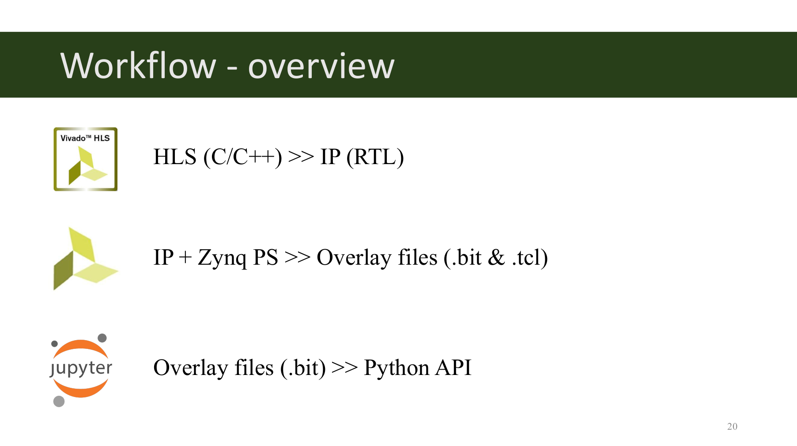

# FPGA simulation - hardware accelartion of a binary neural network

Project of FPGA (PYNQ-Z2) simulation to test inference time on software and hardware (re-implementation)

### Task: BNN on Cifar-10
- Objective – image classification
- NN – ConvNet (Conv*6, MaxPool*3, FC*3)
- Dataset – Cifar-10
- Quantization – 1 or 2 bit

### FPGA 
- PYNQ-Z2 (512MB)

### Platforms & Tools
- Xilinx Vivado HLS & Vivado

### Overview of process

1. Vivado HLS - HLS (C/C++) >> IP (RTL)
2. Vivado - IP + Zynq PS >> Overlay files (.bit & .tcl)
3. Jupyter Notebook - Overlay files (.bit) >> Python API (to control the interfaces of PYNQ-Z2)

### Research survey & Detailed description in the simulation process

See [PDF](./FPGA_survey_PYNQ-BNN_demo.pdf).

### Reference

Xilinx official repo - [link](https://github.com/Xilinx/BNN-PYNQ/tree/master)

BNN Paper - [link](https://dl.acm.org/doi/10.1145/3020078.3021744)
